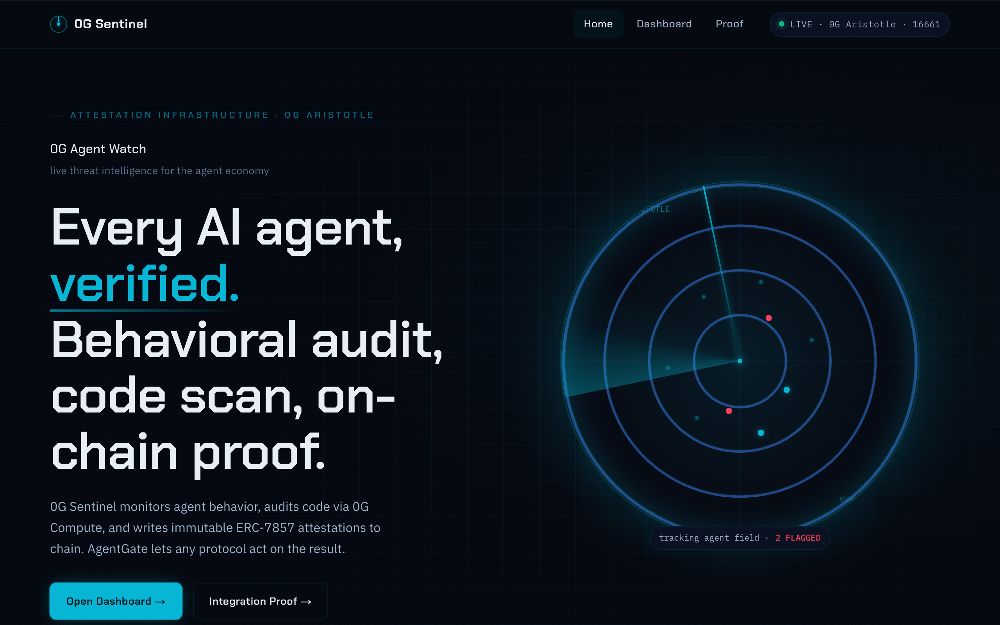
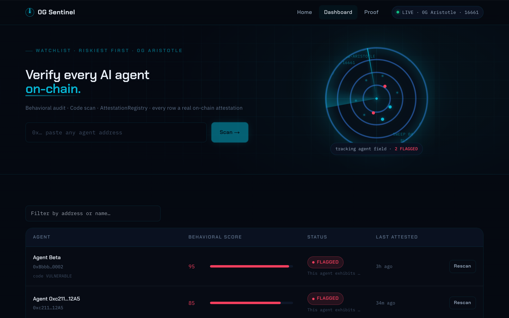
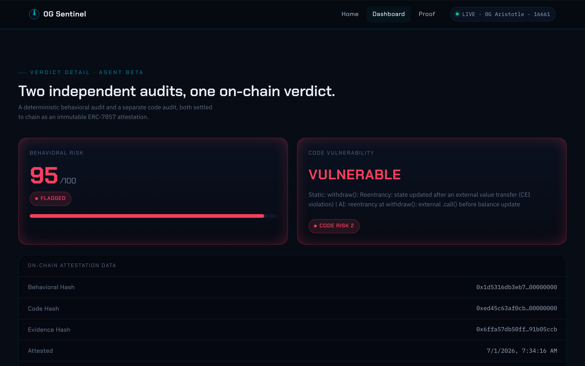
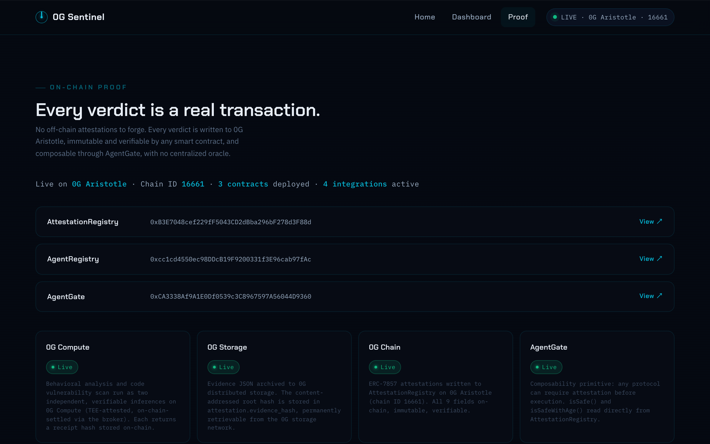

# 0G Sentinel: On-chain security attestations for AI agents

Security infrastructure for the AI agent era. 0G Sentinel discovers every active contract on 0G Aristotle via chain logs, scans them through two independent AI inference pipelines, and writes immutable 9-field attestations to 0G Chain. Any dApp, orchestrator, or smart contract can query attestations in a single call and gate execution on the result, with no agent registration required.

[](https://www.typescriptlang.org/)
[](https://soliditylang.org/)
[](https://nextjs.org/)
[](https://chainscan.0g.ai)
[]()
[](LICENSE)



## Live Demo

**[https://0g-sentinel.vercel.app](https://0g-sentinel.vercel.app)**

Browse the live agent database, scan any 0G Aristotle address, and inspect on-chain attestation proofs.

---

## What Is 0G Sentinel?

AI agents operate on-chain with real funds. There is currently no standard way to verify whether an agent is safe before granting it access to a protocol. 0G Sentinel fills that gap.

It discovers active contracts directly from chain logs (no manual registration), runs two parallel AI audits (behavioral risk from tx history, fund flows, and access patterns, plus a Solidity vulnerability scan), and writes a 9-field attestation struct to `AttestationRegistry` on 0G Chain. Both AI calls go through 0G Compute's inference network, each returning a unique cryptographic receipt hash stored on-chain as proof of independent verification.

A background queue auto-scans every newly discovered contract. Results appear progressively as each attestation lands on-chain. Any protocol can gate agent execution on the result with a single `isSafe()` call.

AgentMesh audits developer code. 0G Sentinel audits live agents on mainnet and writes ERC-7857 on-chain identity attestations.

---

## Deployed Contracts (0G Aristotle Mainnet)

| Contract | Address | Explorer |
|----------|---------|---------|
| AttestationRegistry | `0xB3E7048cef229fF5043CD2dBba296bF278d3F88d` | [View](https://chainscan.0g.ai/address/0xB3E7048cef229fF5043CD2dBba296bF278d3F88d) |
| AgentRegistry | `0xcc1cd4550ec98DDcB19F9200331f3E96cab97fAc` | [View](https://chainscan.0g.ai/address/0xcc1cd4550ec98DDcB19F9200331f3E96cab97fAc) |
| AgentGate | `0xCA3338Af9A1E0Df0539c3C8967597A56044D9360` | [View](https://chainscan.0g.ai/address/0xCA3338Af9A1E0Df0539c3C8967597A56044D9360) |

Chain ID: 16661 (0G Aristotle Mainnet)

See [`submission/proof.md`](submission/proof.md) for live attestation data and on-chain transaction hashes.

---

## Screenshots

| Agent Database | Chain Discovery |
|----------------|-----------------|
|  |  |

| Agent Detail | Integration Proof |
|--------------|------------------|
|  |  |

---

## Features

- **Chain-native discovery**: Scans the last 10,000 blocks via `eth_getLogs` to find every active contract on 0G Aristotle, sorted by event activity, no manual setup required
- **Background auto-scan queue**: All discovered contracts are enqueued for scanning automatically; scans run serially to avoid nonce collisions; results appear progressively as each attestation lands on-chain (requires a persistent server process)
- **Dual AI pipelines**: Two independent 0G Compute inference calls per scan, each with a unique `zg-res-key` receipt UUID stored on-chain as proof of independent verification
- **Behavioral risk scoring**: 0-100 risk score from tx frequency, fund outflow patterns, and contract interaction breadth
- **Smart contract vulnerability scan**: Reentrancy, broken access control, and unchecked-call detection via AI code analysis
- **Immutable on-chain attestations**: 9-field struct written to `AttestationRegistry`, queryable by any dApp with a single call; includes full LLM reasoning string
- **Live agent database**: Paginated, searchable table of all attested agents with inline AI reasoning and threat badges
- **AgentGate composability**: Drop-in security gate for any protocol; `isSafe()` and `isSafeWithAge()` read `AttestationRegistry` directly, no intermediary
- **Evidence archival**: Full scan evidence JSON content-addressed and hashed; `evidence_hash` stored immutably in attestation struct
- **OpenClaw skill**: `openclaw-skill/0g-sentinel-scan.json` enables AI orchestrators to trigger scans as a native tool call

---

## Tech Stack

| Layer | Technology |
|-------|-----------|
| Frontend | Next.js 14.2, React, TypeScript |
| Smart Contracts | Solidity 0.8, Hardhat |
| AI Inference | 0G Compute (`router-api.0g.ai/v1`), 0GM-1.0-35B-A3B model |
| Evidence Storage | `@0gfoundation/0g-ts-sdk` 1.2.8, SHA256 content hash |
| Chain | 0G Aristotle Mainnet (chain ID 16661) |
| Wallet | ethers.js v6 |

---

## How It Works

```
                     0G Sentinel Scanner
                           |
          +----------------+----------------+
          |                                 |
   Pipeline 1: Behavioral          Pipeline 2: Code Scan
   (0G Compute / 0GM model)        (0G Compute / 0GM model)
   - tx frequency analysis         - Solidity AST analysis
   - fund flow anomalies           - reentrancy detection
   - access control patterns       - broken access control
          |                                 |
   behavioral_receipt_hash          code_receipt_hash
   (unique per inference)           (unique per inference)
          |                                 |
          +----------------+----------------+
                           |
                   Evidence Archive
                   (0G Storage SDK)
                   evidence_hash
                           |
                  AttestationRegistry
                  (0G Chain, mainnet)
                  9-field attestation struct:
                  behavioral_score (0-100)
                  threat_level (SAFE/CAUTION/FLAGGED)
                  code_risk (CLEAN/WARNING/VULNERABLE)
                  code_findings (string)
                  reasoning (string, LLM explanation)
                  behavioral_receipt_hash (bytes32)
                  code_receipt_hash (bytes32)
                  evidence_hash (bytes32)
                  attestation_timestamp (uint256)
                           |
                      AgentGate
                  (composability primitive)
                  gates execution based on
                  attestation verdict
```

1. **Discover**: `/api/discover` scans last 10k blocks via `eth_getLogs`; every contract that emitted events is a candidate
2. **Queue**: All discovered addresses enqueue for background auto-scanning (serial, nonce-safe)
3. **Scan**: Two parallel AI pipelines run via 0G Compute for each address
4. **Archive**: Evidence JSON uploaded to 0G Storage; SHA256 root hash stored
5. **Attest**: Scanner writes 9-field attestation to `AttestationRegistry` on 0G Chain
6. **Gate**: `AgentGate` reads attestation; reverts if agent is flagged or unscanned

Each pipeline call produces a unique `zg-res-key` receipt UUID from the 0G router, converted to a bytes32 hash. Both hashes stored on-chain prove two independent AI verifications ran.

---

## Running Locally

```bash
# 1. Install dependencies
npm install
cd frontend && npm install && cd ..

# 2. Set environment variables
cp frontend/.env.example frontend/.env.local
# Fill in: ZERO_G_COMPUTE_API_KEY, ZERO_G_PRIVATE_KEY, and verify contract addresses

# 3. Compile contracts
npx hardhat compile

# 4. Deploy to 0G testnet (optional: mainnet contracts are already live)
npx hardhat run scripts/deploy/01_deploy_registry.ts --network zerogTestnet
npx hardhat run scripts/deploy/02_deploy_attestation.ts --network zerogTestnet
npx hardhat run scripts/deploy/03_deploy_gate.ts --network zerogTestnet

# 5. Run frontend
cd frontend && npm run dev
```

Open [http://localhost:3000/agents](http://localhost:3000/agents).

The dashboard auto-discovers active contracts from chain logs on load. To scan an agent, paste any 0G Aristotle address into the hero scan panel and submit.

---

## Running a Scan

```typescript
import { runFullScan } from "./scanner/scanner";

const result = await runFullScan("0xAgentAddress");
console.log(result.threat_level);         // 0=SAFE, 1=CAUTION, 2=FLAGGED
console.log(result.code_risk);            // 0=CLEAN, 1=WARNING, 2=VULNERABLE
console.log(result.attestation_tx_hash);  // on-chain proof
```

## Querying Attestations On-Chain

```solidity
IAttestationRegistry registry = IAttestationRegistry(REGISTRY_ADDRESS);
Attestation memory att = registry.getAttestation(agentAddress);
require(att.threat_level < 2, "Agent is flagged");
require(att.code_risk < 2, "Agent has vulnerabilities");
```

---

## API Reference

| Method | Endpoint | Description |
|--------|----------|-------------|
| GET | `/api/health` | Service health, RPC endpoint, registry address |
| GET | `/api/agents` | All attested agents with on-chain attestation data |
| GET | `/api/discover` | Discover active contracts from chain logs (last 10k blocks) |
| GET | `/api/scan/queue` | Background auto-scan queue status (queued, inFlight, completed, failed) |
| POST | `/api/scan/behavioral` | Trigger behavioral + full scan for an agent address |
| POST | `/api/scan/code` | Trigger code vulnerability scan only |

---

## Project Structure

```
0g-sentinel/
├── contracts/
│   ├── AttestationRegistry.sol   # Core: stores 9-field attestation struct
│   ├── AgentRegistry.sol         # Agent registration list
│   └── AgentGate.sol             # Composability: gates on attestation verdict
├── scanner/
│   ├── scanner.ts                # Main pipeline orchestrator
│   ├── behavioral.ts             # Pipeline 1: behavioral risk analysis
│   ├── code-scan.ts              # Pipeline 2: Solidity vulnerability scan
│   ├── compute.ts                # 0G Compute API client
│   └── storage.ts                # 0G Storage evidence archival
├── frontend/
│   ├── app/
│   │   ├── agents/               # Agent database + detail pages
│   │   ├── proof/                # Integration proof page
│   │   └── api/
│   │       ├── agents/           # Attested agent list
│   │       ├── discover/         # Chain-native contract discovery
│   │       └── scan/
│   │           ├── behavioral/   # Full scan trigger
│   │           └── queue/        # Auto-scan queue status
│   ├── components/
│   │   ├── AgentsTable.tsx       # Paginated, searchable agent list
│   │   ├── ChainDiscovery.tsx    # Live chain contract discovery panel
│   │   ├── QueueBanner.tsx       # Auto-scan progress bar
│   │   └── ScanInput.tsx         # Hero scan input
│   └── scanner/
│       └── queue.ts              # Background auto-scan queue singleton
├── openclaw-skill/
│   └── 0g-sentinel-scan.json     # OpenClaw skill manifest
├── scripts/
│   ├── deploy/                   # Hardhat deploy scripts
│   └── seed-demo.ts              # Seed demo agents with real attestations
└── tests/                        # 82 tests across unit, integration, E2E
```

---

## OpenClaw Skill

0G Sentinel ships an OpenClaw-compatible skill manifest at `openclaw-skill/0g-sentinel-scan.json`, enabling AI orchestrators to invoke security scans as a native tool call.

---

## License

MIT

---

Built for 0G APAC Hackathon 2026. Track T1 (Agentic Infrastructure + OpenClaw Lab).
